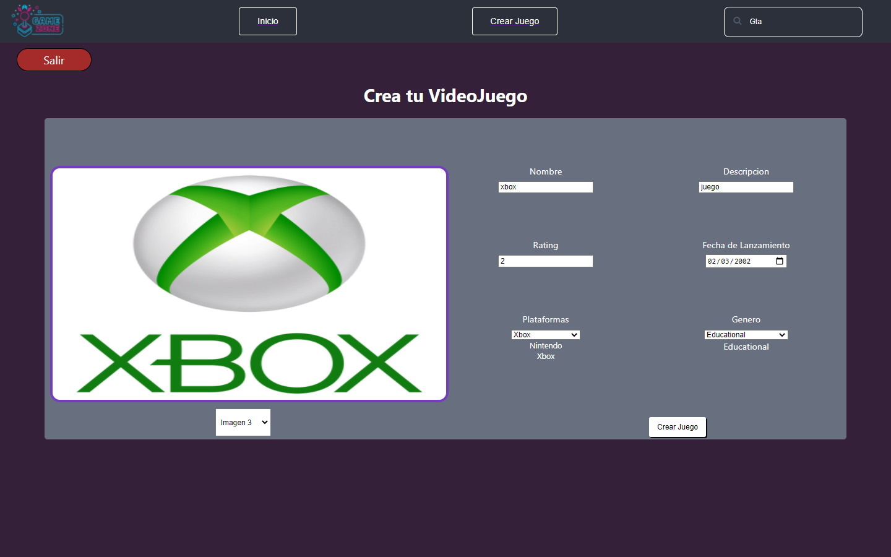
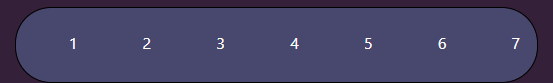

<h1>Videogames <h1/>

  

    
   # Pagina Inicial
    

    

  
    
En la pagina inicial encontraremos un total de 15 juegos en el cual su primer vista va a ser el nombre del juego y sus respectivos generos 

    <h3>Caracteristicas del juego </h3>  
    
    

    
 
Tambien tendremos forma de filtrar, ya sea por genero y ya sea por ordenamiento de mayor a menor rating y de la A-Z Y de Z-A 

 

    
    
    

 
 

  <h2>Crear un videojuego </h2>
  
Tambien podremos generar un nuevo videojuego

    
  

  
  
 
  <h2>Paginado</h2>
  
Por ultimo tenemos el paginado, en el cual podremos ir en pagina en pagina viendo asi nuevos juegos

  
  
  

  
    
Tecnologias usadas
<table>
 React
     
 Redux
     
 Express
     
 Sequelize - PostgreSQL
     
      </table>
